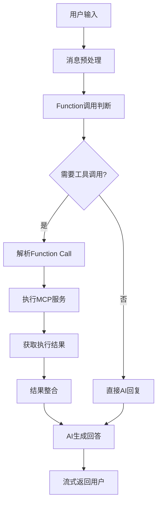

# FlowVO - 智能对话与向量检索平台

## 📖 项目概述

FlowVO 是一个基于微服务架构的智能对话和向量检索平台，集成了自然语言处理、向量数据库和数据管理功能。该平台通过 Function Call 机制处理用户请求，提供智能化服务体验。

### 🎯 核心特性

- **🤖 智能对话系统**：基于大语言模型的多轮对话，支持上下文理解
- **🔍 向量检索引擎**：基于Milvus的高性能向量检索，支持文档语义搜索
- **📊 Function Call机制**：智能工具调用，实现复杂业务逻辑处理
- **📁 文档智能解析**：支持PDF、Word、Excel、PPT等多种格式自动解析
- **🔗 微服务架构**：模块化设计，高可扩展性和维护性
- **🎨 现代化UI**：React + Chakra UI，响应式设计，像素风格界面

## 🚀 快速启动

```bash
# 给脚本添加执行权限并启动
chmod +x start.sh && ./start.sh

# 访问前端应用
http://localhost:5173
```

### 🤖 本地模型离线运行（推荐）

为获得最佳体验，建议预先下载嵌入模型以实现完全离线运行：

```bash
# 激活Python环境并下载模型
source embedding_env/bin/activate
cd python && python download_model.py
```

**本地模型优势：**
- ✅ **无需VPN**：完全离线运行，无网络依赖
- ✅ **启动更快**：避免运行时下载模型
- ✅ **更高稳定性**：不受网络状况影响
- ✅ **隐私保护**：文本处理完全在本地

**详细文档**：
- 📖 [完整安装部署文档](docs/完整安装部署文档.md)
- 📋 [项目更新日志](docs/CHANGELOG.md)

## 🏗️ 系统架构

### 总体架构图
```
FlowVO智能对话平台
├── 前端层 (Presentation Layer)
│   ├── flowvo-ui (React + Chakra UI)
│   └── Floreo (Vue.js)
├── 应用服务层 (Application Layer)  
│   ├── app (核心应用服务)
│   ├── agents (Spring AI智能体)
│   └── api (API网关)
├── 业务服务层 (Business Layer)
│   ├── core (核心业务逻辑)
│   └── eureka (服务注册发现)
├── 数据服务层 (Data Layer)
│   ├── mcp/fileMCP (文件操作服务)
│   ├── mcp/mcp-mysql (数据库服务)
│   └── python (嵌入服务)
└── 存储层 (Storage Layer)
    ├── Milvus (向量数据库)
    ├── MySQL (关系数据库)
    └── MinIO (对象存储)
```

### 微服务架构设计

#### 🎯 核心服务模块
- **App服务 (8080)**：主应用服务，处理用户认证、权限管理、静态资源
- **Agents服务 (8081)**：Spring AI智能体服务，处理文档解析、向量化、AI对话
- **API网关**：统一入口，负载均衡，服务路由
- **Eureka服务**：服务注册与发现中心

#### 🔧 数据处理服务
- **Python嵌入服务 (8000)**：基于Sentence Transformers的文本嵌入
- **Milvus向量数据库 (19530)**：高性能向量存储与检索
- **MCP服务集群**：模块化控制协议，提供数据库和文件操作

#### 📊 业务数据管理
- **订单管理系统**：完整的订单生命周期管理
- **文档管理系统**：智能文档解析、存储、检索
- **用户管理系统**：用户认证、权限、个人资料管理

## 💻 技术栈详解

### 前端技术
```typescript
// 新版UI - React生态
React 18 + TypeScript        // 核心框架
Chakra UI                     // 组件库
React Router                  // 路由管理
Axios                         // HTTP客户端
Markdown解析                  // 内容渲染
代码高亮                      // 语法着色

// 经典UI - Vue生态  
Vue.js 3 + TypeScript        // 渐进式框架
@heroicons/vue               // 图标库
@headlessui/vue              // 无头组件
```

### 后端技术
```java
// Java微服务栈
Spring Boot 3.x              // 应用框架
Spring Cloud                 // 微服务套件
Spring AI                    // AI集成框架
Spring Security              // 安全框架
Spring Data JPA              // 数据访问
Netflix Eureka               // 服务发现

// 数据处理
MySQL 8.0                    // 关系数据库
Milvus 2.5                   // 向量数据库
Redis                        // 缓存服务
MinIO                        // 对象存储
```

### Python AI服务
```python
# 核心AI库
LangChain                    // AI应用框架
Sentence Transformers        // 文本嵌入
FastAPI                      // Web框架
Uvicorn                      // ASGI服务器

# 文档处理
Apache PDFBox                // PDF解析
Apache POI                   // Office文档
Pandas                       // 数据处理
```

## 🔄 Function Call工作流程

### 智能对话处理机制


### MCP服务调用流程
1. **请求解析**：解析用户意图，识别需要调用的工具
2. **参数提取**：从用户输入中提取函数调用参数
3. **服务路由**：根据功能类型路由到相应的MCP服务
4. **结果处理**：处理服务返回结果，格式化为可读内容
5. **响应生成**：结合AI模型生成自然语言回复

## 📊 功能模块详解

### 1. 智能对话系统

#### PixelChat对话引擎
- **多轮对话管理**：维护完整对话上下文，支持话题切换
- **消息类型支持**：文本、图片、文件、代码等多媒体内容
- **实时渲染**：Markdown实时渲染，代码语法高亮
- **对话历史**：按日期分组的对话记录，快速检索

#### AI模型集成
- **OpenAI GPT系列**：支持GPT-3.5、GPT-4等模型
- **本地模型支持**：可接入开源大语言模型
- **模型切换**：动态切换不同AI模型
- **参数调优**：温度、top-p等参数自定义

### 2. 文档智能处理

#### 多格式文档解析
```javascript
支持格式:
├── PDF文档 (.pdf)           // 文本提取
├── Word文档 (.doc, .docx)   // 格式保留
├── Excel表格 (.xls, .xlsx)  // 数据结构化
├── PowerPoint (.ppt, .pptx) // 幻灯片分组
├── 文本文件 (.txt, .md)     // 直接读取
└── 代码文件 (.java, .py等)  // 语法识别
```

#### 向量化存储
- **文档切分**：智能段落分割，保持语义完整性
- **嵌入生成**：Sentence Transformers生成高质量向量
- **向量存储**：Milvus高性能向量数据库存储
- **语义检索**：基于余弦相似度的语义搜索

### 3. 订单管理系统

#### 完整业务流程
- **订单创建**：自动生成唯一订单号，状态管理
- **订单查询**：多维度搜索，分页展示
- **订单处理**：状态流转，金额变更
- **数据统计**：订单分析，业绩报表

#### 技术特性
```sql
-- 高性能查询设计
INDEX idx_order_number (order_number)    -- 订单号查询
INDEX idx_customer_name (customer_name)  -- 客户查询  
INDEX idx_status (status)                -- 状态筛选
INDEX idx_created_at (created_at)        -- 时间范围
```

### 4. 用户管理系统

#### 认证与授权
- **JWT Token**：无状态身份认证
- **角色权限**：基于角色的访问控制(RBAC)
- **密码安全**：BCrypt加密存储
- **会话管理**：Token过期、刷新机制

#### 个人资料管理
- **基础信息**：用户名、昵称、邮箱管理
- **头像系统**：图片上传、存储、访问
- **设置中心**：个性化配置管理

## 🔧 开发特性

### 智能启动脚本
- **🔍 健康检查**：自动检测服务状态
- **🔄 智能重启**：应用服务支持热重启
- **🛡️ 数据保护**：数据库服务按需启动
- **📊 状态监控**：实时显示所有服务状态

### 开发者友好
- **🔥 热重载**：前端开发热更新
- **📝 详细日志**：结构化日志记录
- **🐛 错误处理**：完善的异常处理机制
- **📡 API文档**：Swagger自动生成API文档

### 生产就绪
- **⚡ 性能优化**：数据库索引、缓存策略
- **🔒 安全加固**：SQL注入防护、XSS防护
- **📈 监控告警**：健康检查端点
- **🔄 容灾备份**：数据备份策略

## 🌟 创新亮点

### 1. 像素风格UI设计
- **马里奥风格机器人**：64x72像素精美角色
- **动态装饰元素**：彩色方块动画效果
- **复古游戏风格**：像素化界面设计
- **现代交互体验**：保持良好的用户体验

### 2. 智能文档处理
- **Office文档深度解析**：保持原始结构信息
- **大文件优化处理**：内存占用控制
- **智能乱码检测**：文本编码自动识别
- **多媒体内容支持**：图片、表格、代码混合处理

### 3. 微服务解耦设计
- **服务独立部署**：各服务可独立扩展
- **API标准化**：RESTful + JSON-RPC
- **配置外部化**：环境变量管理
- **服务发现机制**：动态服务注册

## 📈 性能优化

### 数据库优化
```sql
-- 索引策略
CREATE INDEX idx_conversation_id ON chat_messages(conversation_id);
CREATE INDEX idx_user_id ON documents(user_id);
CREATE INDEX idx_created_at ON conversations(created_at);

-- 分页查询优化
SELECT * FROM orders 
WHERE created_at >= ? AND created_at <= ?
ORDER BY created_at DESC 
LIMIT ? OFFSET ?;
```

### 向量检索优化
- **索引类型**：IVF_FLAT索引，平衡精度与性能
- **相似度算法**：余弦相似度，适合文本语义
- **批量操作**：向量批量插入，提升吞吐量
- **缓存策略**：热点向量缓存，加速检索

### 应用层优化
- **连接池**：数据库连接池配置
- **异步处理**：文件上传异步处理
- **内存管理**：大文件流式处理
- **缓存机制**：Redis缓存热点数据

## 🔮 未来规划

### 短期目标
- [ ] **多模态支持**：图像理解与生成
- [ ] **实时协作**：多用户协同编辑
- [ ] **API限流**：接口访问频率控制
- [ ] **监控仪表板**：系统运行状态可视化

### 长期愿景
- [ ] **知识图谱**：构建领域知识图谱
- [ ] **联邦学习**：分布式模型训练
- [ ] **边缘计算**：模型边缘部署
- [ ] **多租户架构**：企业级多租户支持

## 🤝 贡献指南

### 开发环境搭建
1. **克隆仓库**：`git clone https://github.com/username/flowvo.git`
2. **环境配置**：复制`.env.example`为`.env`，配置API密钥
3. **一键启动**：运行`./start.sh`启动所有服务
4. **开发调试**：使用`./start.sh --restart`快速重启应用

### 代码规范
- **Java**：遵循阿里巴巴Java开发手册
- **TypeScript**：使用ESLint + Prettier格式化
- **数据库**：使用规范的命名约定和索引策略
- **Git**：使用Conventional Commits规范

### 提交流程
1. Fork项目仓库
2. 创建功能分支：`git checkout -b feature/your-feature`
3. 提交更改：`git commit -m "feat: add your feature"`
4. 推送分支：`git push origin feature/your-feature`
5. 创建Pull Request

---

**FlowVO** - 让AI对话更智能，让向量检索更高效 🚀

*Built with ❤️ by FlowVO Team*