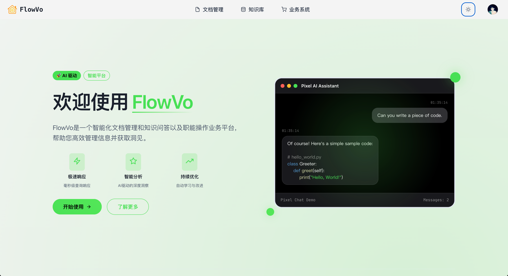
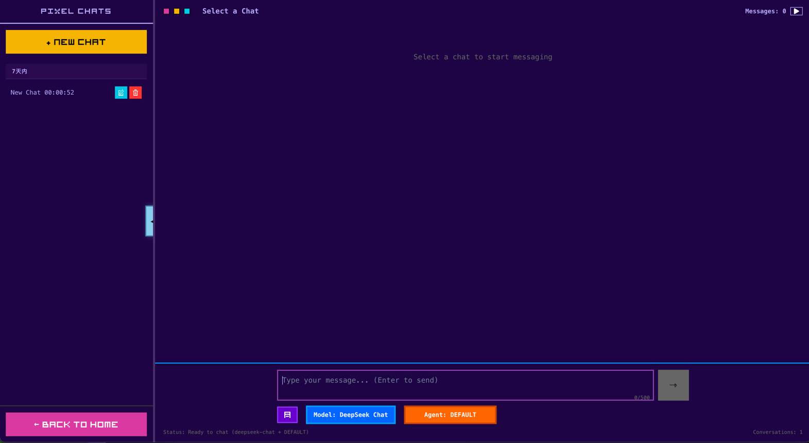
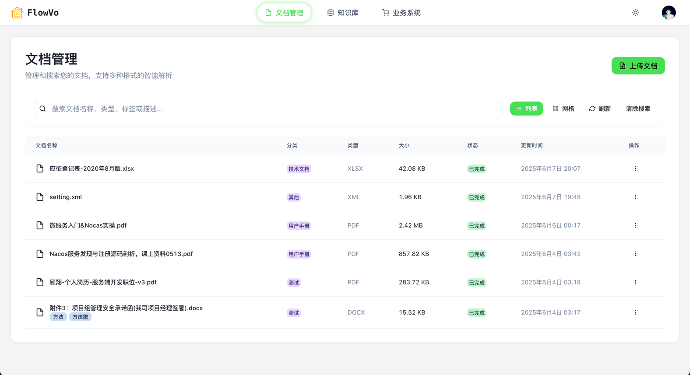
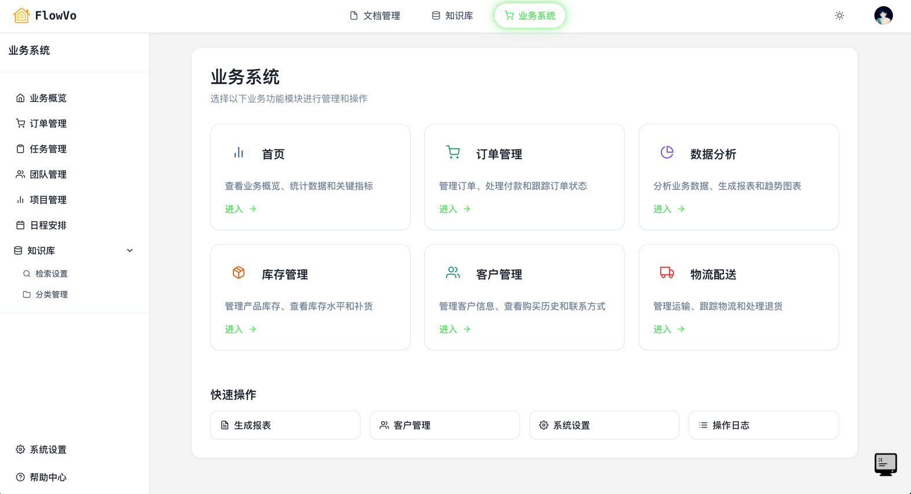

# FlowVO - 智能平台

## 📖 项目概述

FlowVO 是一个基于微服务架构的智能对话和向量检索平台，集成了自然语言处理、向量数据库和数据管理功能。该平台通过 Function Call 机制处理用户请求，以及智能化MCP服务体验。








### 🎯 核心特性

- **🤖 智能对话系统**：基于大语言模型的多轮对话，支持上下文理解
- **🔍 向量检索引擎**：基于Milvus的高性能向量检索，支持文档语义搜索
- **📊 Function Call机制**：智能工具调用，实现复杂业务逻辑处理
- **📁 文档智能解析**：支持PDF、Word、Excel、PPT等多种格式自动解析
- **🔗 微服务架构**：模块化设计，高可扩展性和维护性
- **🎨 现代化UI**：React + Chakra UI，响应式设计，像素风格界面

## 🚀 快速启动

```bash
# 给脚本添加执行权限并启动
chmod +x start.sh && ./start.sh

# 访问前端应用
http://localhost:5173
```

### 🤖 本地模型离线运行（推荐）

为获得最佳体验，建议预先下载嵌入模型以实现完全离线运行：

```bash
# 激活Python环境并下载模型
source embedding_env/bin/activate
cd python && python download_model.py
```

**本地模型优势：**
- ✅ **无需VPN**：完全离线运行，无网络依赖
- ✅ **启动更快**：避免运行时下载模型
- ✅ **更高稳定性**：不受网络状况影响
- ✅ **隐私保护**：文本处理完全在本地

**详细文档**：
- 📖 [完整安装部署文档](docs/完整安装部署文档.md)
- 📋 [项目更新日志](docs/CHANGELOG.md)

## 🏗️ 系统架构

### 总体架构图
```
FlowVO智能对话平台 (微服务+API网关架构)
├── 前端层 (Presentation Layer)
│   ├── flowvo-ui (React + Chakra UI)  [5173]
│   └── Floreo (Vue.js)                [其他端口]
├── 网关层 (Gateway Layer)
│   └── api-gateway (统一入口)          [9870]
│       ├── 路由转发 (请求分发)
│       ├── JWT认证 (统一认证)
│       ├── 权限控制 (访问控制)
│       └── CORS配置 (跨域处理)
├── 应用服务层 (Application Layer)  
│   ├── app (核心应用服务)              [8080]
│   ├── agents (Spring AI智能体)        [8081]
│   └── eureka (服务注册发现)           [8761]
├── 业务服务层 (Business Layer)
│   └── core (核心业务逻辑)
├── 数据服务层 (Data Layer)
│   ├── mcp/fileMCP (文件操作服务)
│   ├── mcp/mcp-mysql (数据库服务)
│   └── python (嵌入服务)               [8000]
└── 存储层 (Storage Layer)
    ├── Milvus (向量数据库)             [19530]
    ├── MySQL (关系数据库)              [3306]
    └── MinIO (对象存储)                [9000]
```

### 新架构请求流程
```
用户请求 → API网关(9870) → JWT认证 → 路由分发
                ↓
        ┌───────┴───────┐
        ↓               ↓
   App服务(8080)    Agents服务(8081)
        ↓               ↓
   业务逻辑处理      AI智能处理
        ↓               ↓
     响应返回       响应返回
        ↓               ↓
        └───────┬───────┘
                ↓
          API网关聚合响应
                ↓
           返回给前端
```

### 微服务架构设计

#### 🎯 API网关服务 (9870) - **新增**
- **JWT认证校验**：验证所有请求的JWT令牌有效性，确保安全访问
- **智能路由转发**：根据请求路径智能分发到相应的微服务
- **用户信息传递**：认证成功后将用户信息添加到请求头传递给下游服务
- **统一跨域处理**：集中管理CORS配置，解决前端跨域问题
- **白名单管理**：灵活配置无需认证的接口路径
- **安全防护**：统一的安全策略和错误处理

#### 🔐 网关认证机制（集中式安全）
```
架构优势：
✅ 集中式认证：网关统一处理JWT验证，避免重复认证
✅ 性能优化：下游服务不需要重复解析JWT，提高响应速度
✅ 代码简化：微服务只需从请求头获取用户信息，减少安全代码
✅ 统一管理：安全策略统一配置，便于维护和升级

请求流程：
1. 用户登录 → App服务生成JWT Token
2. 携带Token访问API → 网关验证Token有效性
3. 验证成功 → 网关添加用户信息到请求头
4. 转发到目标服务 → 服务从请求头获取用户信息（X-User-Name, X-User-Id）
5. 返回响应 → 网关统一处理响应

白名单路径（无需认证）：
- /api/auth/login     (登录)
- /api/auth/register  (注册)  
- /api/auth/check-email (邮箱验证)
- /uploads/**         (静态资源)
- /js/**, /css/**     (前端资源)

认证路径（需要JWT）：
- /api/knowledge-qa/** (知识库问答)
- /api/orders/**       (订单管理)
- /api/chat/**         (聊天对话)
- /api/v1/documents/** (文档管理)
- /api/vision/**       (视觉AI)

下游服务简化：
- 移除复杂的JWT认证过滤器
- 使用UserContextUtil.getCurrentUsername()获取用户信息
- 专注业务逻辑，不处理认证逻辑
```

#### 🎯 核心服务模块
- **App服务 (8080)**：核心业务服务，处理用户管理、订单、聊天、文档、视觉AI
- **Agents服务 (8081)**：Spring AI智能体服务，处理文档解析、向量化、AI对话
- **Eureka服务 (8761)**：服务注册与发现中心（可选）

#### 📋 路由规则配置
```yaml
路由映射:
├── 认证相关: /api/auth/**          → API网关直接处理
├── 知识库问答: /api/knowledge-qa/** → 网关认证后调用agents服务
├── 核心业务: /api/orders/**        → 转发到app服务
├── 聊天对话: /api/chat/**          → 转发到app服务
├── 文档管理: /api/v1/documents/**  → 转发到app服务
├── 视觉AI: /api/vision/**          → 转发到app服务
└── 静态资源: /uploads/**           → 转发到app服务
```

#### 🔧 数据处理服务
- **Python嵌入服务 (8000)**：基于Sentence Transformers的文本嵌入
- **Milvus向量数据库 (19530)**：高性能向量存储与检索
- **MCP服务集群**：模块化控制协议，提供数据库和文件操作

#### 📊 业务数据管理
- **订单管理系统**：完整的订单生命周期管理
- **文档管理系统**：智能文档解析、存储、检索
- **用户管理系统**：用户认证、权限、个人资料管理

## 💻 技术栈详解

### 前端技术
```typescript
// 新版UI - React生态
React 18 + TypeScript        // 核心框架
Chakra UI                     // 组件库
React Router                  // 路由管理
Axios                         // HTTP客户端
Markdown解析                  // 内容渲染
代码高亮                      // 语法着色

// 经典UI - Vue生态  
Vue.js 3 + TypeScript        // 渐进式框架
@heroicons/vue               // 图标库
@headlessui/vue              // 无头组件
```

### 后端技术
```java
// Java微服务栈
Spring Boot 3.x              // 应用框架
Spring Cloud                 // 微服务套件
Spring AI                    // AI集成框架
Spring Security              // 安全框架
Spring Data JPA              // 数据访问
Netflix Eureka               // 服务发现

// 数据处理
MySQL 8.0                    // 关系数据库
Milvus 2.5                   // 向量数据库
Redis                        // 缓存服务
MinIO                        // 对象存储
```

### Python AI服务
```python
# 核心AI库
LangChain                    // AI应用框架
Sentence Transformers        // 文本嵌入
FastAPI                      // Web框架
Uvicorn                      // ASGI服务器

# 文档处理
Apache PDFBox                // PDF解析
Apache POI                   // Office文档
Pandas                       // 数据处理
```

## 🔄 Function Call工作流程

### 智能对话处理机制

```mermaid
graph TD
    A[用户输入] --> B[消息预处理]
    B --> C[Function调用判断]
    C --> D{需要工具调用?}
    D -->|是| E[解析Function Call]
    D -->|否| F[直接AI回复]
    E --> G[执行MCP服务]
    G --> H[获取执行结果]
    H --> D{需要工具调用?}
    H --> I[结果整合]
    I --> J[AI生成回答]
    F --> J
    J --> K[流式返回用户]
```


### MCP服务调用流程
1. **请求解析**：解析用户意图，识别需要调用的工具
2. **参数提取**：从用户输入中提取函数调用参数
3. **服务路由**：根据功能类型路由到相应的MCP服务
4. **结果处理**：处理服务返回结果，格式化为可读内容
5. **响应生成**：结合AI模型生成自然语言回复

## 📊 功能模块详解

### 1. 智能对话系统

#### PixelChat对话引擎
- **多轮对话管理**：维护完整对话上下文，支持话题切换
- **消息类型支持**：文本、图片、文件、代码等多媒体内容
- **实时渲染**：Markdown实时渲染，代码语法高亮
- **对话历史**：按日期分组的对话记录，快速检索

#### AI模型集成
- **OpenAI GPT系列**：支持GPT-3.5、GPT-4等模型
- **本地模型支持**：可接入开源大语言模型
- **模型切换**：动态切换不同AI模型
- **参数调优**：温度、top-p等参数自定义

### 2. 文档智能处理

#### 多格式文档解析
```javascript
支持格式:
├── PDF文档 (.pdf)           // 文本提取
├── Word文档 (.doc, .docx)   // 格式保留
├── Excel表格 (.xls, .xlsx)  // 数据结构化
├── PowerPoint (.ppt, .pptx) // 幻灯片分组
├── 文本文件 (.txt, .md)     // 直接读取
└── 代码文件 (.java, .py等)  // 语法识别
```

#### 向量化存储
- **文档切分**：智能段落分割，保持语义完整性
- **嵌入生成**：Sentence Transformers生成高质量向量
- **向量存储**：Milvus高性能向量数据库存储
- **语义检索**：基于余弦相似度的语义搜索

### 3. 订单管理系统

#### 完整业务流程
- **订单创建**：自动生成唯一订单号，状态管理
- **订单查询**：多维度搜索，分页展示
- **订单处理**：状态流转，金额变更
- **数据统计**：订单分析，业绩报表

#### 技术特性
```sql
-- 高性能查询设计
INDEX idx_order_number (order_number)    -- 订单号查询
INDEX idx_customer_name (customer_name)  -- 客户查询  
INDEX idx_status (status)                -- 状态筛选
INDEX idx_created_at (created_at)        -- 时间范围
```

### 4. 用户管理系统

#### 认证与授权
- **JWT Token**：无状态身份认证
- **角色权限**：基于角色的访问控制(RBAC)
- **密码安全**：BCrypt加密存储
- **会话管理**：Token过期、刷新机制

#### 个人资料管理
- **基础信息**：用户名、昵称、邮箱管理
- **头像系统**：图片上传、存储、访问
- **设置中心**：个性化配置管理

### 📁 知识库问答系统

#### RAG问答引擎
- **智能问答**：基于Spring AI RAG架构的知识库问答
- **向量检索**：使用Milvus进行文档相似度检索
- **文档溯源**：显示答案来源文档，支持原文跳转
- **分类管理**：文档按类别组织，支持分类筛选问答

#### 🎨 前端功能特性
```javascript
用户界面:
├── 智能问答界面 (参数可调节)
├── 实时流式回答 (支持同步/流式两种模式)
├── 搜索参数控制 (topK数量、相似度阈值)
├── 分类筛选问答 (按文档分类限制范围)
├── 热门问题快捷 (点击快速填入问题)
├── 详细结果展示 (问题、回答、响应时间、相似度)
├── 信息来源展示 (文档标题、页码、原文内容)
├── Markdown渲染 (富文本格式回答)
├── 操作功能集成 (复制回答、提交反馈评分)
├── 最近提问记录 (历史问答、分类标签、评分)
├── 热门问题排行 (基于趋势算法推荐)
├── 知识库分类统计 (文档数量、完成率、更新时间)
└── 分类文档管理 (查看分类下所有文档)
```

#### 📊 后端API功能
```javascript
API接口:
├── 同步问答 (API: /api/knowledge-qa/ask)
├── 流式问答 (API: /api/knowledge-qa/ask-stream)
├── 最近提问 (显示历史问答记录)
├── 热门问题 (基于趋势算法推荐)
├── 分类统计 (各类别文档统计信息)
├── 用户反馈 (问答质量评分)
├── 分类管理 (文档分类CRUD操作)
└── 文档管理 (分类查看、文档详情)
```

#### 🔧 核心算法
- **相似度计算**：基于向量余弦相似度的文档匹配
- **上下文构建**：智能提取最相关的文档片段
- **趋势分析**：时间衰减 + 频次统计的热门问题算法
- **关键词提取**：自动提取问题关键词用于统计分析

#### 🗂️ 数据模型
- **问答记录表**：`knowledge_qa_records` - 完整问答会话记录
- **文档分类表**：`document_categories` - 分类管理(用户手册、技术文档、培训材料、FAQ、政策制度、其他)
- **热门问题表**：`popular_questions` - 问题热度统计与趋势分析
- **文档表扩展**：添加`category`字段支持分类关联

#### 🚀 使用流程
1. **文档上传**：上传文档时选择分类，系统自动向量化处理
2. **智能问答**：输入问题，选择搜索参数(分类、数量、阈值)
3. **查看回答**：获得AI回答和详细的文档来源信息
4. **反馈评分**：对回答质量进行评分，帮助系统优化
5. **历史查看**：浏览问答历史、热门问题和分类统计

### 2. 文档智能处理

## 🔧 开发特性

### 智能启动脚本
- **🔍 健康检查**：自动检测服务状态
- **🔄 智能重启**：应用服务支持热重启
- **🛡️ 数据保护**：数据库服务按需启动
- **📊 状态监控**：实时显示所有服务状态

### 开发者友好
- **🔥 热重载**：前端开发热更新
- **📝 详细日志**：结构化日志记录
- **🐛 错误处理**：完善的异常处理机制
- **📡 API文档**：Swagger自动生成API文档

### 生产就绪
- **⚡ 性能优化**：数据库索引、缓存策略
- **🔒 安全加固**：SQL注入防护、XSS防护
- **📈 监控告警**：健康检查端点
- **🔄 容灾备份**：数据备份策略

## 🌟 创新亮点

### 1. 像素风格UI设计
- **马里奥风格机器人**：64x72像素精美角色
- **动态装饰元素**：彩色方块动画效果
- **复古游戏风格**：像素化界面设计
- **现代交互体验**：保持良好的用户体验

### 2. 智能文档处理
- **Office文档深度解析**：保持原始结构信息
- **大文件优化处理**：内存占用控制
- **智能乱码检测**：文本编码自动识别
- **多媒体内容支持**：图片、表格、代码混合处理

### 3. 微服务解耦设计
- **服务独立部署**：各服务可独立扩展
- **API标准化**：RESTful + JSON-RPC
- **配置外部化**：环境变量管理
- **服务发现机制**：动态服务注册

## 📈 性能优化

### 数据库优化
```sql
-- 索引策略
CREATE INDEX idx_conversation_id ON chat_messages(conversation_id);
CREATE INDEX idx_user_id ON documents(user_id);
CREATE INDEX idx_created_at ON conversations(created_at);

-- 分页查询优化
SELECT * FROM orders 
WHERE created_at >= ? AND created_at <= ?
ORDER BY created_at DESC 
LIMIT ? OFFSET ?;
```

### 向量检索优化
- **索引类型**：IVF_FLAT索引，平衡精度与性能
- **相似度算法**：余弦相似度，适合文本语义
- **批量操作**：向量批量插入，提升吞吐量
- **缓存策略**：热点向量缓存，加速检索

### 应用层优化
- **连接池**：数据库连接池配置
- **异步处理**：文件上传异步处理
- **内存管理**：大文件流式处理
- **缓存机制**：Redis缓存热点数据

## 🔮 未来规划

### 短期目标
- [ ] **多模态支持**：图像理解与生成
- [ ] **实时协作**：多用户协同编辑
- [ ] **API限流**：接口访问频率控制
- [ ] **监控仪表板**：系统运行状态可视化

### 长期愿景
- [ ] **知识图谱**：构建领域知识图谱
- [ ] **联邦学习**：分布式模型训练
- [ ] **边缘计算**：模型边缘部署
- [ ] **多租户架构**：企业级多租户支持

## 🤝 贡献指南

### 开发环境搭建
1. **克隆仓库**：`git clone https://github.com/username/flowvo.git`
2. **环境配置**：复制`.env.example`为`.env`，配置API密钥
3. **一键启动**：运行`./start.sh`启动所有服务
4. **开发调试**：使用`./start.sh --restart`快速重启应用

### 代码规范
- **Java**：遵循阿里巴巴Java开发手册
- **TypeScript**：使用ESLint + Prettier格式化
- **数据库**：使用规范的命名约定和索引策略
- **Git**：使用Conventional Commits规范

### 提交流程
1. Fork项目仓库
2. 创建功能分支：`git checkout -b feature/your-feature`
3. 提交更改：`git commit -m "feat: add your feature"`
4. 推送分支：`git push origin feature/your-feature`
5. 创建Pull Request

---

**FlowVO** - 让AI对话更智能，让向量检索更高效 🚀

*Built with ❤️ by FlowVO Team*