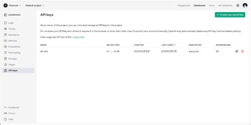
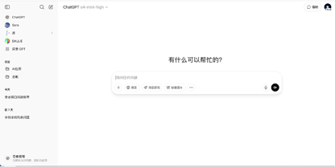
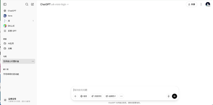
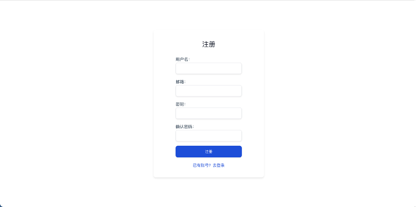
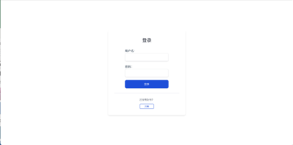
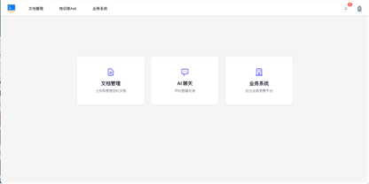
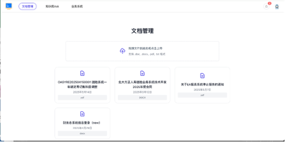
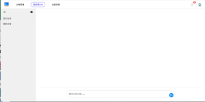
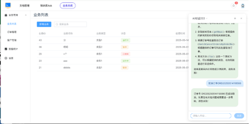

模仿参照页面：
 

原页面：

    最终目的：用新的框架以及组件实现我的原前端应用，具体功能页面见原页面截图，切记只需要实现功能，不需要参考原页面设计风格以及UI样式甚至页面结构。参考页面是用来给你参照排版以及元素样式等等，不需要仿照截图实现功能

    总结
    •	主框架：React + Vite；
	•	组件库：Chakra UI（内置暗黑、可定制、高度可访问）；
	•	动画：Framer Motion；
	•	聊天：手撸气泡 + 打字动画，或 react-chat-elements；
	•	数据 & 状态：React Query + Axios + Zustand。

    1. 核心框架：React + Vite（或 Next.js）
	•	React
	•	生态最活跃，和动画库、状态管理、数据请求、组件库等配合最成熟。
	•	构建工具
	•	Vite：极速冷启动和热更新，便于本地迭代；

    2. 组件库
    Chakra UI
    React 原生组件、原子化设计、内置暗黑模式切换、主题定制友好
    + 开箱即暗黑模式+ 样式 API 简洁+ 配合 Framer Motion 可用 chakra-factory 一行搞定动画

    Ant Design
    企业级常规组件丰富（表格/树形/表单/布局），支持自定义主题
      + 组件最齐全+ Pro 版脚手架成熟+ Less 变量可定制色系

    Radix UI + Tailwind (Shadcn UI)
      Radix 提供“无样式”低级可访问组件，Tailwind 负责快速布局和暗黑切换
      + 极致可定制+ 体量小+ 与 Tailwind 配合效果佳

    3. 样式与主题
	•	Tailwind CSS（可选）
	•	如果想深度自定义，Tailwind + Chakra 双管齐下，按需覆盖 Chakra 主题。
	•	CSS 变量主题
	•	Chakra 自带 extendTheme({ config: { initialColorMode: 'dark' } })，默认深色+高对比。
	•	全局布局
	•	侧边栏 + 顶部菜单 + 主内容区。

    4. 动画库
	•	Framer Motion
	•	最流行、易上手：<motion.div initial=… animate=… exit=…>；
	•	AnimatePresence 做路由进出场；
	•	Layout 属性帮你轻松实现列表卡片增删流动动画。
	•	Chakra + Framer Motion
	•	用 @chakra-ui/framer-motion ，将 Chakra 组件一键转成可动画化版本。

    5. 聊天组件
	1.	手撸 vs 现成库
	•	手撸：用 Chakra 的 Flex、Box、Avatar、Textarea + Framer Motion 做「打字机效果」；
	•	组件库：
	•	react-chat-ui-kit（Stream Chat 官方）；
	•	react-chat-elements（开源、样式可定制）。
	2.	建议
	•	如果只是基本问答流，手撸 + Framer Motion 就能做出很酷的「消息气泡+打字中」效果；
	•	需要高级功能（消息回滚、状态管理、多媒体）可引入 react-chat-elements。

    6. 状态管理 & 数据请求
	•	数据请求：
	•	React Query（@tanstack/react-query）+ Axios，缓存/刷新/轮询一手掌握。
	•	全局状态：
	•	Zustand：API 极简、高性能，比 Redux 轻量；
	•	或 Chakra 自带的 useDisclosure/useTheme + React Context。

    7. 目录结构
    /src
      /components      # 可复用 UI 组件（按钮、卡片、气泡）
     /layouts         # 布局组件 (SidebarLayout, ChatLayout)
     /pages           # Vite：react-router；Next：pages 路由
       /chat          # 聊天页
       /dashboard     # 管理台页
     /hooks           # 自定义 Hook (useChat, useAuth)
     /stores          # Zustand 全局状态
     /api             # Axios 实例 & 接口函数
     /theme           # Chakra extendTheme
     /utils           # 工具函数

    8. 关键依赖示例
    {
      "dependencies": {
        "react": "^18.x",
        "react-dom": "^18.x",
        "react-router-dom": "^6.x",     // Vite 路由
        "next": "^13.x",                // 若用 Next.js
        "@chakra-ui/react": "^2.x",
        "@emotion/react": "^11.x",
        "@emotion/styled": "^11.x",
        "framer-motion": "^10.x",
        "@tanstack/react-query": "^4.x",
        "axios": "^1.x",
        "zustand": "^4.x"
        // 若用 chat 元件： "react-chat-elements": "^11.x"
      }
    }

    9. 开发步骤概要
    1.	搭建脚手架
    •	npm init vite@latest my-app --template react-ts
    •	安装 Chakra & Framer Motion、React Query、Zustand 等依赖
    2.	全局主题
    •	在 src/theme/index.ts 用 extendTheme 配置暗黑模式、主色、圆角、动画曲线
    3.	布局组件
    •	SidebarLayout／ChatLayout
    4.	路由
    •	Dashboard 各页面 + Chat 路由
    5.	聊天框
    •	基础消息气泡组件 + 输入框 + 「打字中」动画
    6.	管理台
    •	引入 Chakra 表格、表单、卡片，配合 React Query CRUD
    7.	优化
    •	按需引入组件（import { Button } from '@chakra-ui/react'）
    •	打包体积分析 & Tree-Shaking

    以上的实现步骤请帮我写一个README.md,实现步骤、每一步的执行命令以及搭建